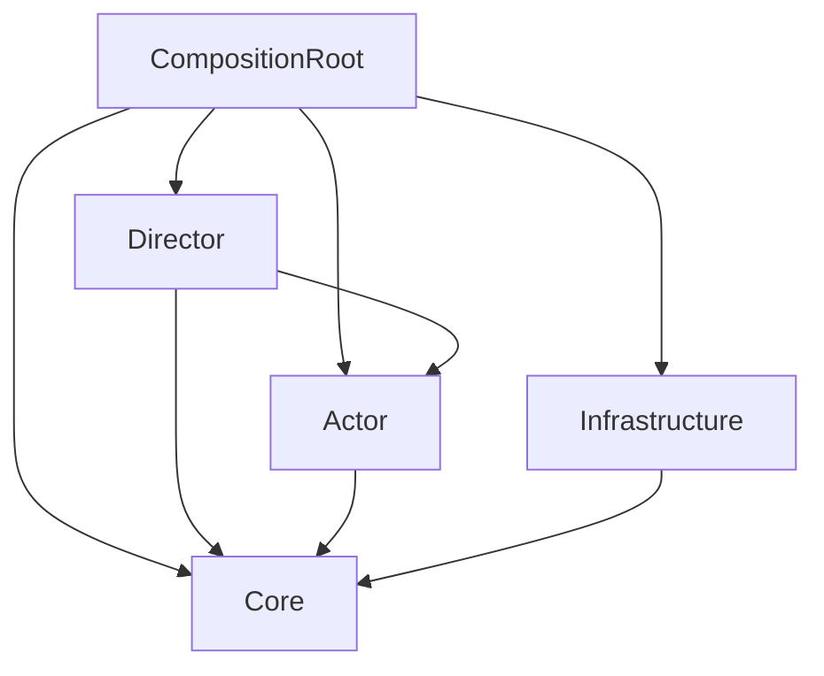

# Web Portfolio Otoge

made from [Unity Single Scene Template](https://github.com/kageki128/unity-single-scene-template)

ポートフォリオサイトに埋め込む音ゲー

## 技術スタック

### Unityレジストリ

- TextMeshPro
- Addressables
- Newtonsoft Json

### 外部ライブラリ

- UniTask
- R3 (+ Observable Collection)
- MessagePipe
- VContainer
- LitMotion (+ LitMotion.Animation)
- Kyub EmojiSearch API

### エディタ拡張

- vHierarchy 2
- Auto Save

## アーキテクチャ (Kageki Architecture)

ゲーム制作においてドメインとフレームワークを切り離すことが困難なことを考慮したアーキテクチャ。Pure C#のCore (心臓) とMonoBehaviourのActor (演者) の両方でドメインを担当し、Director (監督) がそれをオーケストレーションする。開発速度と保守性が両立でき、初学者にも分かりやすい。

注意: ここにおいてPure C#なクラスとはMonoBehaviourを継承しないクラスと定義する。簡単のため、Pure C#であっても必要ならMathfやVector3などのUnityライブラリ、R3, UniTaskなどの外部ライブラリは使用しても構わない。

### Core層

Pure C#で書かれる。従来のドメイン層に相当し、単一のドメインを可能な限り集約しカプセル化する。ただし、MonoBehaviour側に書いたほうが都合が良い部分については、無理せずActor層に分離することを許可する。

- Core
- Port
    - Repositoryなど、Infrastructure層に実装させるインターフェース

### Actor層

MonoBehaviourを継承する。従来のViewに相当し、2DモデルやuGUIなど、ゲーム画面に映るオブジェクトを担当する。必要ならここにドメインを書いたり、Core層のメソッドを叩いたりしてもよい。ただし、特に理由が無いのであれば、可能な限りMVRPパターンにおけるView (完全に受け身なオブジェクト) のように振る舞い、イベントを通知し、Directorに処理をハンドリングさせる形になるよう努めること。

- Actor
- Factory
    - あるActorを生成することに責任を持つオブジェクト
- Component
    - Actorにアタッチして使用する汎用コンポーネント

### Director層

Pure C#で書かれる。MVRPパターンにおけるPresenterに相当する。Actorのイベントを購読してCoreを操作、あるいはその逆を行う。具体的なロジックは書かず、CoreやActorに委譲する形が望ましい。また、Sceneにただひとつ、DirectorのRootたるEntryPointを用意し、ライフサイクルメソッドはここに集約される。

- EntryPoint
    - Sceneにただひとつ存在するエントリーポイント
- Director

### Infrastructure層

基本的にPure C#で書かれる。セーブやロード、サーバーといった技術的感心を集約し、Core層のPortを実装する。

### CompositionRoot層

MonoBehaviourを継承する。DIコンテナを用いて依存性の解決とEntryPointのライフサイクルメソッドの起動を行う。DIの関係で特権的に全ての層に依存する。

### 依存関係

## コーディング規約

- private修飾子は省略
- privateフィールドの接頭辞にアンダースコアをつけない
- UniTaskのメソッドは可能な限り有効なCancellationTokenを渡す/渡せるようにする
- R3の購読管理はCompositionDisposableを用いて確実に行う
- テストはUnity Test Runnerを用い、テストコードはScripts/Tests以下に配置する
